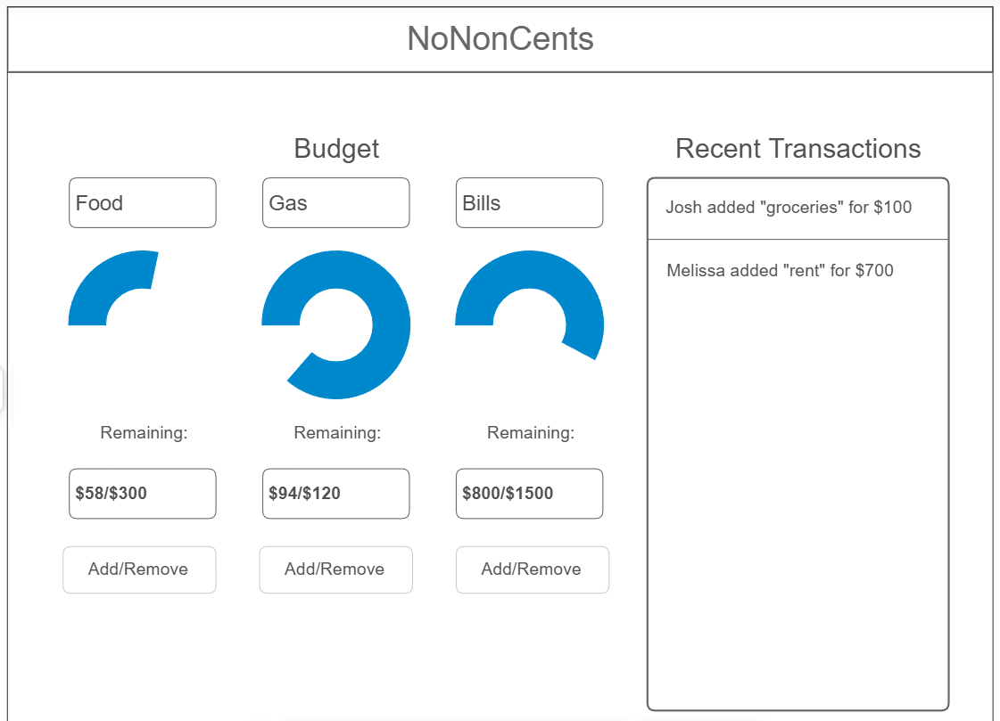

# NoNonCents: A Minimal Budget Tracker for Couples

[My Notes](notes.md)

A good budget app is hard to find - especially without having to pay for it! Central to this project is the principal that keeping track of funds collaboratively should be simple, easy, and free.

## 🚀 Specification Deliverable

For this deliverable I did the following. I checked the box `[x]` and added a description for things I completed.

- [x] Proper use of Markdown
- [x] A concise and compelling elevator pitch
- [x] Description of key features
- [x] Description of how you will use each technology
- [x] One or more rough sketches of your application. Images must be embedded in this file using Markdown image references.

### Elevator pitch

Everyone knows budgeting is a good practice, especially if you want to save money for school or maintain a healthy relationship. The problem is that too many existing budget apps don't actually provide an efficient solution for keeping track of your spending. Some have unnecessary invasive features, while others hide design flaws behind complex interfaces. To make matters worse, some budget apps even cost money themselves! NoNonCents is a minimalistic and collaborative budget tracker for couples and roommates. It will be simple, efficient, and open source. Ditch the spreadsheets and start saving money with NoNonCents!

### Design

### Key features

- Creating, reading, updating, and deleting of budget categories and expense items
- Sharing budgets between multiple users
- Real-time updating of recent transactions
- A random weekly recipe from the Tasty API to inspire you to plan meals ahead and try new foods!

### Technologies

I am going to use the required technologies in the following ways.

- **HTML** - Page structure will be implemented with HTML templates. There will be an overview page, a login page, and a join budget page, with links for navigation between them.
- **CSS** - Used for dynamic styling that optimizes screen space on multiple device types
- **React** - Used for dynamic page elements such as indicator graphs for funds remaining in each category
- **Service** - Backend that serves requests for creating, joining, and deleting budgets, as well as CRUD operations on budget categories and expense items. Also handles user creation and authentication requests. Makes calls to the Tasty API to suggest a random recipe every week on the bottom of the overview page.
- **DB/Login** - Used to persistently store important user and budget data, as well as the weekly random recipe.
- **WebSocket** - Used for real-time updates that allow collaborative expense tracking. Through this, each user on a budget will see all budget updates in real-time on the "Recent Transactions" section of the overview page.

## 🚀 AWS deliverable

For this deliverable I did the following. I checked the box `[x]` and added a description for things I completed.

- [x] **Server deployed and accessible with custom domain name** - [My server link](https://echowebprogramming.click).

## 🚀 HTML deliverable

For this deliverable I did the following. I checked the box `[x]` and added a description for things I completed.

- [x] **HTML pages** - I created pages for logging in, viewing the budget, adding expenses, and adding/editing budget categories
- [x] **Proper HTML element usage** - I used body, nav, main, header, and footer elements as well as others like section and progress
- [x] **Links** - I created links between all pages for easy navigation
- [x] **Text** - I included necessary text, including page titles in headers and my name in the footers
- [x] **3rd party API placeholder** - I created a placeholder for the recipe of the day section, which will call the Tasty API
- [x] **Images** - I added a placeholder for an image of the recipe of the day
- [x] **Login placeholder** - I added a simple html form as a placeholder for login functionality, following the Simon HTML example
- [x] **DB data placeholder** - this is represented in edit/delete/create buttons for expenses and categories which will be stored in the DB
- [x] **WebSocket placeholder** - this is represented in the list of recent transactions, which will update in real-time over WS

## 🚀 CSS deliverable

For this deliverable I did the following. I checked the box `[x]` and added a description for things I completed.

- [x] **Header, footer, and main content body** - Made header items line up, added a pleasant color and font to them. Did the same for footer. Moved recipe of the day into body instead of footer. Cleaned up the login/create form on the landing page with centered elements and nice-looking buttons. Made the display of the budget categories dynamic with the width of the screen.
- [x] **Navigation elements** - Completed as part of header
- [x] **Responsive to window resizing** - Budget category and recent transaction elements go from row to column based on width of page, main headers and text stay centered regardless of window size
- [x] **Application elements** - Completed as described above
- [x] **Application text content** - Text is in a pleasant, readable font and color. Links and buttons clearly change color when hovered over.
- [x] **Application images** - Image is a good size and stays centered regardless of window size.

## 🚀 React part 1: Routing deliverable

For this deliverable I did the following. I checked the box `[x]` and added a description for things I completed.

- [x] **Bundled using Vite** - I restructured the project files, installed all necessary dependencies, and created the necessary index.html, index.jsx, and app.jsx (just boilerplate to start with) to get the app running.
- [x] **Components** - I added some boilerplate components for the router to route to.
- [x] **Router** - I added a router in the app component, with routes for login, budget, cateogory, and expense. I copied the html from the old static pages into the new components. I learned a lot more about CSS when fixing some styles that got changed in the process.

## 🚀 React part 2: Reactivity deliverable

For this deliverable I did the following. I checked the box `[x]` and added a description for things I completed.

- [x] **All functionality implemented or mocked out** - including login, create account, recipe of the day information, budget category creation, and expense creation/deletion.
- [x] **Hooks** - I made use of them for all implemented/mocked out functionality

## 🚀 Service deliverable

For this deliverable I did the following. I checked the box `[x]` and added a description for things I completed.

- [ ] **Node.js/Express HTTP service** - I did not complete this part of the deliverable.
- [ ] **Static middleware for frontend** - I did not complete this part of the deliverable.
- [ ] **Calls to third party endpoints** - I did not complete this part of the deliverable.
- [ ] **Backend service endpoints** - I did not complete this part of the deliverable.
- [ ] **Frontend calls service endpoints** - I did not complete this part of the deliverable.
- [ ] **Supports registration, login, logout, and restricted endpoint** - I did not complete this part of the deliverable.

## 🚀 DB deliverable

For this deliverable I did the following. I checked the box `[x]` and added a description for things I completed.

- [ ] **Stores data in MongoDB** - I did not complete this part of the deliverable.
- [ ] **Stores credentials in MongoDB** - I did not complete this part of the deliverable.

## 🚀 WebSocket deliverable

For this deliverable I did the following. I checked the box `[x]` and added a description for things I completed.

- [ ] **Backend listens for WebSocket connection** - I did not complete this part of the deliverable.
- [ ] **Frontend makes WebSocket connection** - I did not complete this part of the deliverable.
- [ ] **Data sent over WebSocket connection** - I did not complete this part of the deliverable.
- [ ] **WebSocket data displayed** - I did not complete this part of the deliverable.
- [ ] **Application is fully functional** - I did not complete this part of the deliverable.
